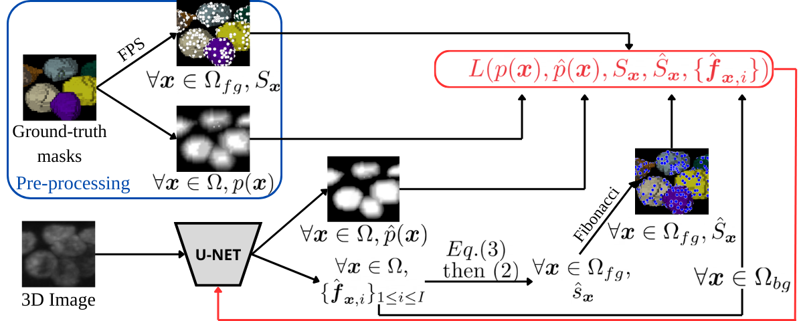
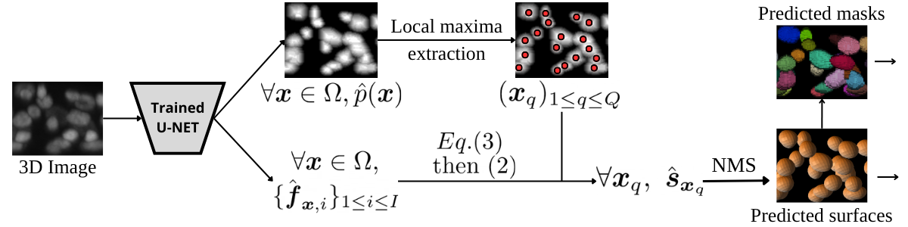

# NAGINI-3D | Prediction of Parametric Surfaces for Multi-Object Segmentation in 3D Biological Imaging

We present NAGINI-3D (N-Active shapes for seGmentINg 3D biological Images), a method dedicated to 3D biological images segmentation, based on both deep learning (CNN) and Active Surfaces (Snakes).

This repository provides the code described in the paper:
- Quentin RAPILLY, Pierre MAINDRON, Guenaelle BOUET-CHALON, Anaïs BADOUAL, Charles KERVRANN.
[*Prediction of Parametric Surfaces for Multi-Object Segmentation in 3D Biological Imaging*](TODO_ajouter_le_lien).
International Conference on Scale Space and Variational Methods in Computer Vision (SSVM), Totnes, England, May 2025.

## Method description

Our approach consists in training a U-Net to:
1. locate the objects of interest in an 3D image using a predicted probability map $\hat{p}$,
2. for each object, predict a set of control points $\{\hat{{f}}_{{x},i}\}_i$ describing a parametric surface $\hat{{s}}_{{x}}$ representing the object located in ${x}$,
3. (optionnal) a snake optimisation procedure based on image gradient can be used to optimize the surfaces.

To evaluate the loss used to train the network, the Ground-Truth (GT) probability map $p$ and a sampling $S$ representing each object of the training dataset are required. Some tools available in this Github will help you pre-process you data to create them.

The training and inference pipeline are summerized on the following figures.

**Training pipeline:**

**Inference pipeline**

More details on the method are provided in the paper mentionned above.

## Installation

The experiments were run using Python 3.10.8. A list of all the packages installed to run the method is provided in [requirements.txt](requirements.txt).

To guarantee the proper functionning of the code and the reproducibility of the experiments, we recommend to create a Singularity container ([installation guide](https://docs.sylabs.io/guides/2.6/user-guide/installation.html)) using the same recipe as us. The recipe [nagini3D.def](singularity/nagini3D.def) and the corresponding requirement file [nagini3D.txt](singularity/nagini3D.txt) are provided in the [singularity directory](singularity).

Once Singularity is installed, run the following command to create the Singularity image:

`singularity build nagini3D.sif <path to nagini3D.def file>`

The image can then be run:

`singularity shell --nv -B <storage to your repository where the code and data are stored>:<storage to your repository where the code and data are stored> <path to the .sif image file>`

If the Docker image selected to create the Singularity image (see in [nagini3D.def](singularity/nagini3D.def)) doesn't match your GPU and CUDA compatibility, find another one [here](https://hub.docker.com/r/pytorch/pytorch/tags) that matches your requirements and with PyTorch>=1.13.

While the image is running, you should have the exact same version of Python, PyTorch and the important packages used to run the code.

## Applying the method

### Preprocessing data for training

